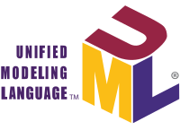

UML 이란?
=====

UML 을 알아보기 전 먼저 <code>모델링</code> 에 대해 알아봐야 한다.  

## 모델링
소프트웨어 개발에서의 모델의 역할은 다음과 같다.
* 소프트웨어 모델을 통해 해석의 공유, 해석의 타당성 검토
* 개발할 소프트웨어의 모습을 가시화
* 시스템의 구조와 행위 명시, 시스템의 틀 구축

### 추상화
모델은 추상화를 바탕으로 만들어져야 한다.  
추상화는 대상을 있는 그대로 표현하는 것이 아닌 필요한 부분만 나타내게 한다.  
따라서 추상화를 바탕으로 필요한 정보들만 모델링해야 한다.

## UML

### 개요
위키백과에 나와있는 UML 의 정의이다.
> 통합 모델링 언어(UML, 영어: Unified Modeling Language)는 소프트웨어 공학에서 사용되는 표준화된 범용 모델링 언어이다.

한마디로 객체 지향 소프트웨어의 모델링에 사용되는 언어이다.

UML 은 고안한 OMG(객체 관리 그룹)에서 관리 중이다.

### 구성요소
UML 의 구성요소는 다음과 같다.
* 행위자 
* 부품
* 행위
* 비즈니스 프로세스
* 프로그래밍 언어 구문
* 데이터베이스 스키마
* 재사용할 수 있는 소프트웨어 구성 요소(컴포넌트 기반 개발)

### UML 다이어그램 종류
분류  | 다이어그램 유형 | 목적
----  | -------------  | ----
구조 다이어그램 | 클래스 다이어그램 | 클래스사이의 관계 표현
     <a>         | 객체 다이어그램   | 객체 정보 표현
<a> | 복합체 구조 다이어그램 | 복합 구조의 클래스와 컴포넌트 구조 표현
<a> | 배치 다이어그램 | 시스템의 물리구조 표현
<a> | 컴포넌트 다이어그램 | 컴포넌트 사이의 구조 표현
<a> | 패키지 다이어그램 | 패키지들 사이의 관계 표현
행위 다이어그램 | 활동 다이어그램 | 업무나 연산 수행 과정 표현
<a> | 상태 머신 다이어그램 | 객체의 생명주기 표현
<a> | 유즈 케이스 다이어그램 | 사용자 관점의 시스템 행위 표현
<a> | 순차 다이어그램 | 시간 흐름에 따른 객체 사이의 상호작용 표현
<a> | 상호작용 개요 다이어그램 | 상호작용 다이어그램 사이의 제어흐름 표현
<a> | 통신 다이어그램 | 객체 사이의 관계를 중심으로 상호작용 표현
<a> | 타이밍 다이어그램 | 객체 상태 변화와 시간 제약 명시적 표현