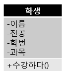
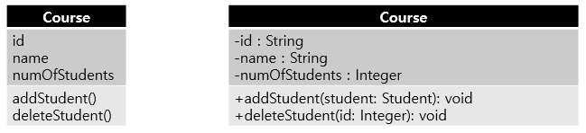

클래스 다이어그램
===============
클래스 다이어그램은 시스템을 구성하는 클래스와 그들 사이의 관계를 보여준다.  
클래스 다이어그램은 대표적인 UML 구조 다이어 그램이다.

## UML의 클래스 표현 예
클래스는 공통된 속성과 연산을 갖는 객체들의 집합이자 객체를 생성하는 설계도이다. 

UML은 다음과 같이 클래스를 표현한다.   
  
가장 윗 부분에는 클래스 이름,  
중간부분에는 클래스의 속성,  
마지막 부분에는 클래스의 연산(메소드)를 기술한다.

## 접근제어자 표현
클래스의 속성과 연산을 기술할 때는 <code>-</code>나 <code>+</code>
와 같은 부호를 사용한다.
이것은 속성과 연산의 <code>가시화(visibility)</code>를 정의한 것이다.  

가시화는 접근제어자를 통해 외부에 속성과 연산을 어느 정도까지 공개하는냐에 따라
달라진다.

접근제어자 | 표시 | 설명
----------|------|----
public | + | 어떤 클래스의 객체든 접근 가능
private | - | 같은 클래스 내의 객체만 접근 가능
protected | # | 같은 패키지나 상속관계의 하위 클래스 객체만 접근 가능
package | ~ | 동일 패키지의 객체만 접근 가능

## 분석과 설계
클래스 다이어그램은 개발 단계에 따라 가시화 정도가 다르다.  
확실히 구분하기 위해 개념 분석 단계와 구현(설계) 단계로 나누어 보자.

왼쪽의 분석 단계 클래스는 구체적인 타입과 가시화 정보를 기술하지 않았다.  
오른쪽의 설계 단계 클래스는 바로 코드 구현할 수 있도록 구체적인 타입정보와 가시화 정보를
기술했다. 

## 관계
객체 지향 시스템은 클래스 하나가 아닌 여러 개의 클래스가 서로 긴밀한 관계를 맺어 형성된다.  
UML 또한 다음과 같이 클래스 간의 관계를 나타낼 수 있다.  

관계 | 설명
-----|----
연관 관계 | 클래스들이 개념상 연결됨. 실선이나 화살표로 표시
일반화 관계 | 상속 관계(Is A 관계). 속이 빈 화살표로 표시
집합 관계 | 클래스 간의 집합 관계. 집약 관계와 합성 관계가 있음.
의존 관계 | 한 클래스가 다른 클래스의 기능을 사용할때. 점선 화살표로 표시
실체화 관계 | 인터페이스와 구현 클래스들 사이의 관계. 속이 빈 점선 화살표로 표시